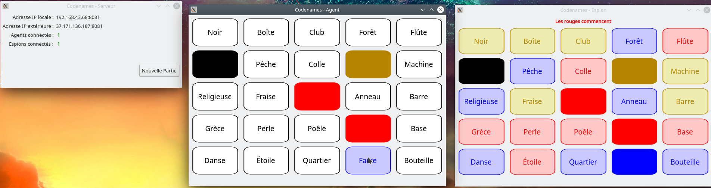

# Codenames

Petit projet fait sous confinement pour pouvoir jouer au jeu Codenames via ordinateur (et en particulier à distance). Les programmes ne fait pas respecter les règles du jeu (elles sont disponibles en ligne si jamais), mais sert juste de plateau virtuel.

## Prérequis

 - Une connexion internet pour le jeu à distance, un routeur (box internet, hotspot WiFi ...) pour le jeu en local
 - Si sous Linux, une ordinateur 64-bits et les librairies partagées Qt5 (qt5-base, qt5-default ... en fonction de votre distribution)

### Configuration du serveur

Il faut configurer le routeur de telle sorte qu'il redirige toutes les informations arrivant sur le port 8081 vers le serveur. Pour cela, il faut créer une règle NAT (Google est votre ami pour comment faire sur votre routeur) avec :
 - Protocole : TCP
 - Port externe : 8081
 - Port interne : 8081
 - Poste : Nom (ou adresse IP locale) de l'ordinateur sur lequel tourne le serveur

## Utilisation

 - [Télecharger](https://github.com/Itrimel/Codenames/releases/latest) le Codenames-client correspondant à votre système
 - Pour la personne faisant tourner le serveur, télécharger aussi Codenames-serveur correspondant à votre système
 - Cette personne lance le serveur
 - Il récupère son adresse IP locale (si les autres joueurs sont sur le même réseau : même box, même routeur, même hotspot ...) ou externe sur le programme pour la donner aux agents
 - Tous les joueurs lancent Codenames-client et rentre l'adresse donnée par le serveur pour se connecter, puis choisir si il jouera la partie en tant qu'agent ou espion (peut être changé à chaque nouvelle partie)
 - Il suffit ensuite un agent de cliquer sur une carte pour signaler qu'il demande à deviner un nom
 
Chaque carte qui aura été devinée sera masquée par sa couleur, il suffit de passer la souris dessus pour voir le mot<br>
Par défaut, le serveur utilise le port 8081 pour les connexions. Si il n'est pas possible de se connecter, vérifie que le routeur ne bloque pas ce port<br> 
Il est possible de rejoindre une partie en cours, le plateau contiendra déjà les mots devinés (pratique en cas d'internet capricieux)<br>

## Apercu



## Compilation

Ce projet dépend de Qt5, il faut donc que au moins `qt5-base` soit présent

### Linux 

```
git clone https://github.com/Itrimel/Codenames.git  
mkdir build  
cd build  
qmake ../Codenames  
make 
```
  
 ### Windows
 
 J'ai pas essayé, mais j'imagine qu'avec la suite Qt Creator il doit être possible de faire quelquechose

## To-do liste pour des améliorations futures

 - [x] Faire en sorte que ~~le serveur et~~ les clients puissent faire espion ou agent indifférement
 - [x] Meilleure gestion des erreurs de connexion
 - [ ] Ajouter un système de mot de passe pour limiter le nombre de personnes pouvant se connecter en tant qu'agent et/ou espion
 - [ ] Créer un client tournant sur Nintendo Switch
 - [ ] Utiliser UPnP pour le serveur
